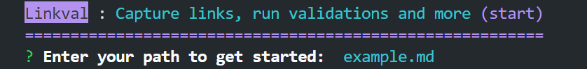
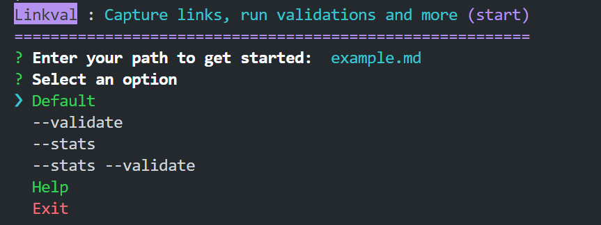
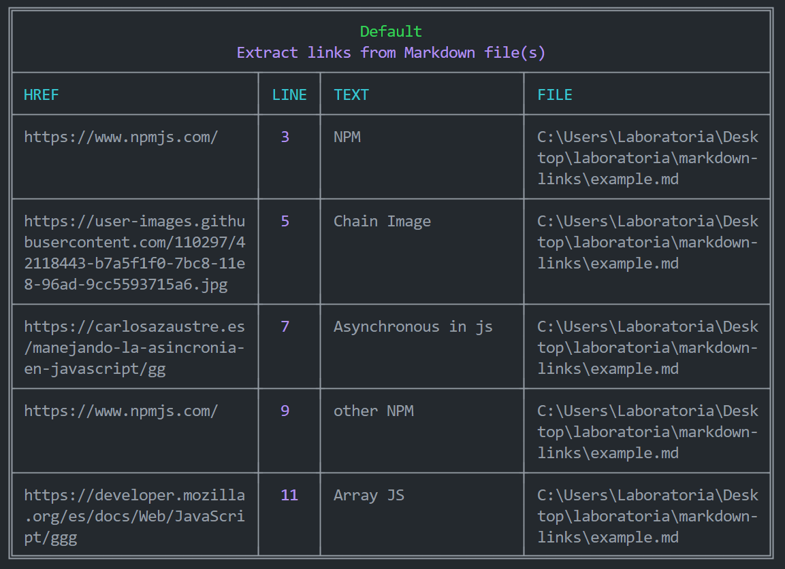
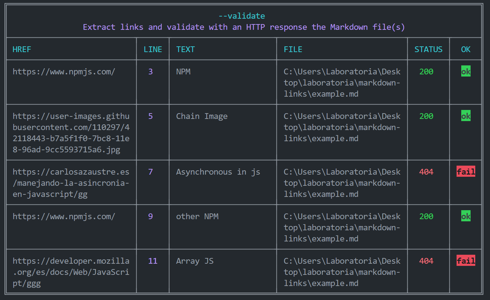
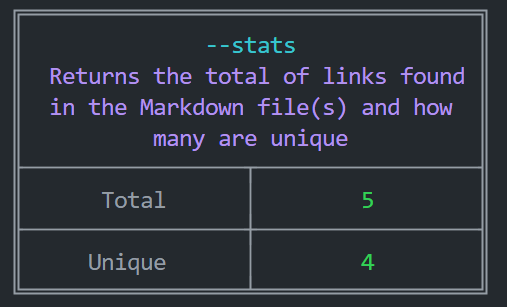
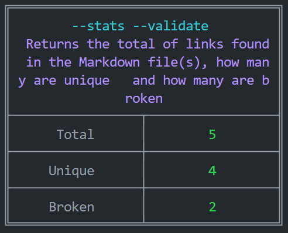
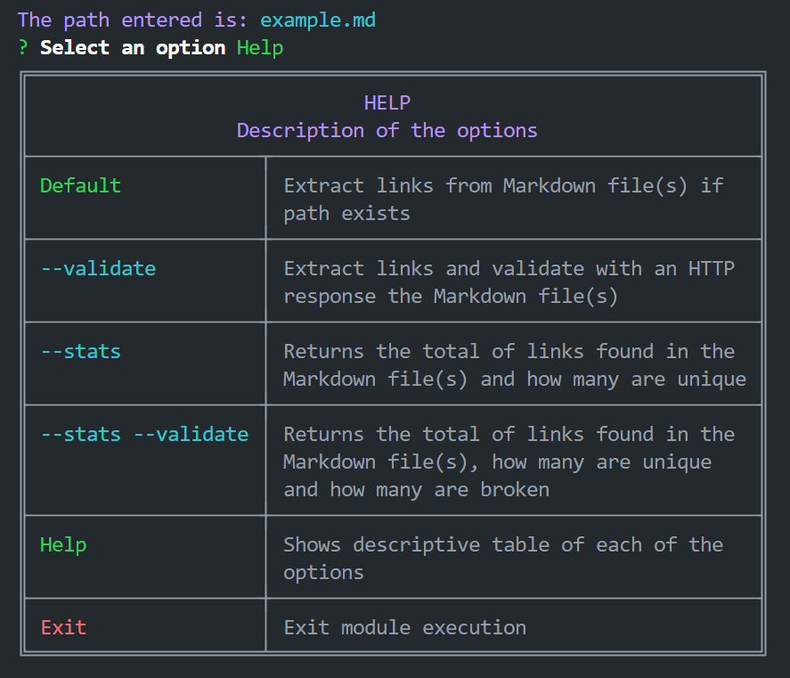
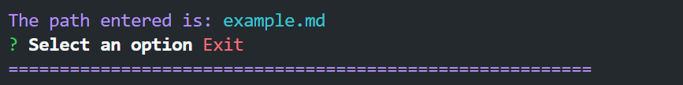
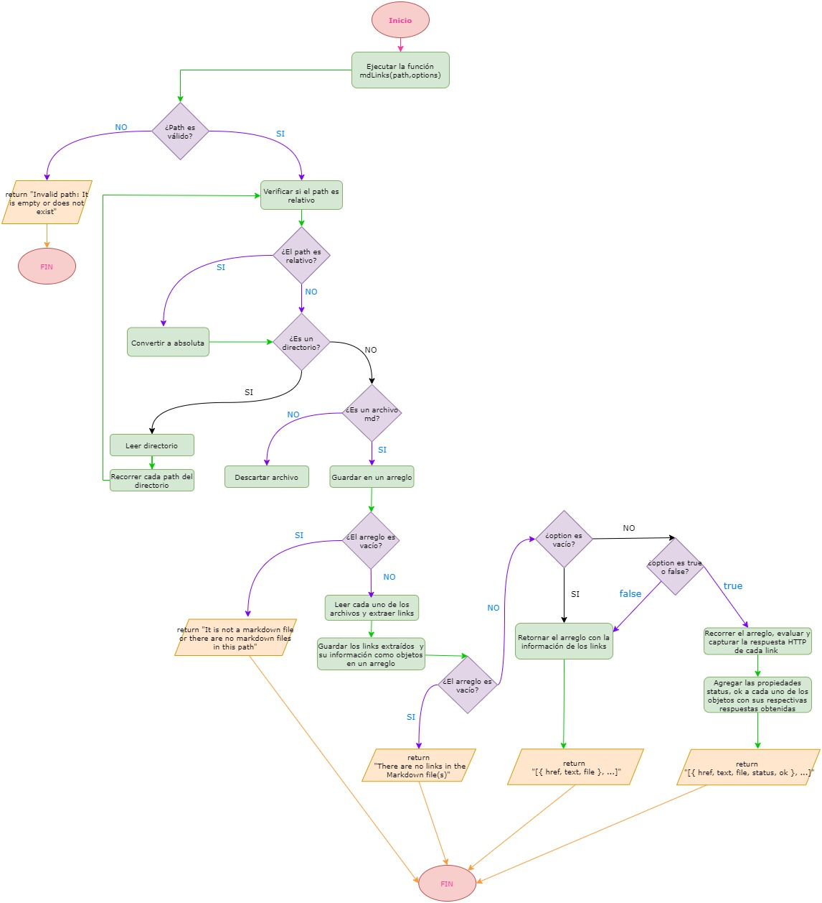
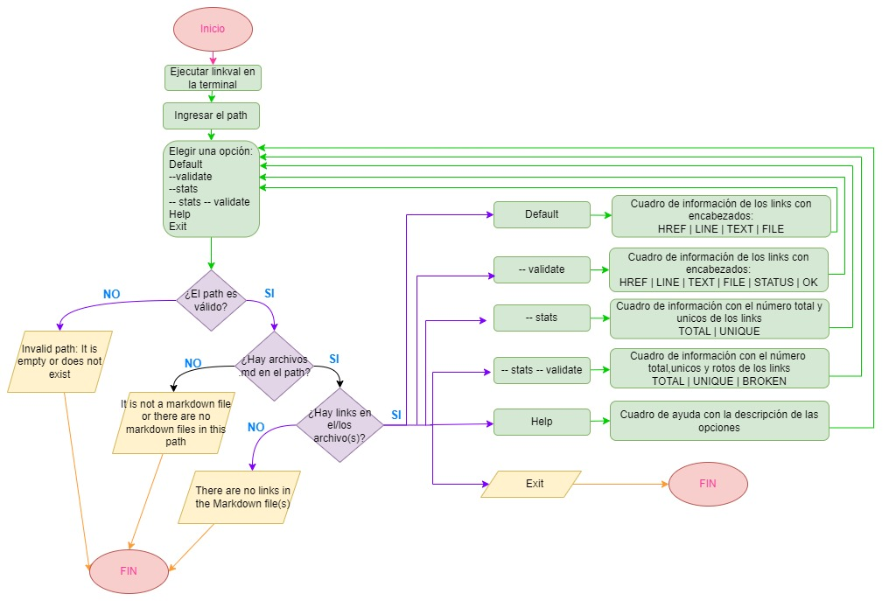

# Linkval

Es una libreria en Javascript que permite leer archivos `Markdown` para verificar los links que contengan y reportar algunas estadísticas , incluyendo si son válidos o no, con solo ingresar una ruta, además de proporcionar una herramienta de línea de comando (CLI).

`Linkval` fue implementado ante la gran demanda de uso de archivos `Markdown` (
GitHub, foros, blogs, ...), además es muy común
encontrar varios archivos en ese formato en cualquier tipo de repositorio, sin embargo, hay una gran problemática, estos archivos `Markdown` normalmente contienen _links_ (vínculos/ligas) que
muchas veces están rotos o ya no son válidos y eso perjudica mucho el valor de
la información que se quiere compartir. Ante esto `Linkvak` viene a solucionar tus problemas.

## Tabla de contenido

- [1 . Documentación](#documentación)

  - [Instalación](#instalación)
  - [Implementación de uso](#implementación-de-uso)
    - [Argumentos](#argumentos)
    - [Valor de retorno](#argumentos)
  - [Ejemplos](#ejemplos-resultados-como-comentarios)

- [2 . Herramienta CLI ](#herramienta-cli-interfaz-de-línea-de-comando)

  - [Implementación de uso](#implementacic3b3n-de-uso-1)
  - [Opciones](#opciones)
  - [Ejemplos](#ejemplos)

- [3 . Diagrama de Flujo](#diagrama-de-flujo)
  - [API](#1-api)
  - [CLI](#2-cli)

## Documentación

### Instalación

```shell
npm install linkval
```

```js
import { mdLinks } from "linkval";

// The path can be a file or directory
//  The second parameter can be true or false
mdLinks("./some/example.md", { validate: true })
  .then((links) => {
    // => [{ href, line, text, file, status, ok }, ...]
  })
  .catch(console.error);
```

### Implementación de uso

#### `mdLinks(path, options)`

#### Argumentos

- `path`: Ruta **absoluta** o **relativa** al **archivo** o **directorio**.

- `options`: Un objeto con **únicamente** la siguiente propiedad:
  - `validate`: Booleano que determina si se desea validar los links
    encontrados:
    - `{validate: true}`
    - `{validate: false}`

#### Valor de retorno

Retorna una promesa (`Promise`) que se **resuelve en un arreglo**
(`Array`) de objetos (`Object`), donde cada objeto representa un link y contiene
las siguientes propiedades

Con `validate:false` :

- `href`: URL encontrada.
- `line`: Linea(s) donde fue encontrada la URL.
- `text`: Texto que aparecía dentro del link (`<a>`).
- `file`: Ruta del archivo donde se encontró el link.

Con `validate:true` :

- `href`: URL encontrada.
- `line`: Linea(s) donde fue encontrada la URL.
- `text`: Texto que aparecía dentro del link (`<a>`).
- `file`: Ruta del archivo donde se encontró el link.
- `status`: Código de respuesta HTTP.
- `ok`: Mensaje `fail` en caso de fallo u `ok` en caso de éxito.

### Ejemplos (resultados como comentarios)

1.  Usar la función `mdLinks` sin segundo argumento `options` ya sea con un `path` de archivo o directorio.

```js
import { mdLinks } from "linkval";

mdLinks("./some/example.md")
  .then((links) => {
    // => [{ href, line, text, file }, ...]
  })
  .catch(console.error);

mdLinks("./some/dir")
  .then((links) => {
    // => [{ href, line, text, file }, ...]
  })
  .catch(console.error);
```

2. Usar la función `mdLinks` con segundo argumento `{validate: false}`, puedes usar archivo o directorio para el `path`

```js
import { mdLinks } from "linkval";

mdLinks("./some/example.md", { validate: false })
  .then((links) => {
    // => [{ href, line, text, file }, ...]
  })
  .catch(console.error);
```

3. Usar la función `mdLinks` con segundo argumento `{validate: true}`, puedes usar archivo o directorio para el `path`

```js
import { mdLinks } from "linkval";

mdLinks("./some/example.md", { validate: true })
  .then((links) => {
    // => [{ href, line, text, file, status, ok }, ...]
  })
  .catch(console.error);
```

## Herramienta CLI (Interfaz de Línea de Comando)

### Implementación de uso

1. Escribir en la terminal `linkval` y ejecutarlo.

```sh
linkval
```

2. Escribir el path que desea analizar.

```sh
? Enter your path to get started: some/example.md
```

3. Elegir entre una de las opciones.

```sh
  Default
  --validate
  --stats
  --stats --validate
  Help
  Exit
```

### Opciones

#### 1. `Default`

El comportamiento por defecto no valida si las URLs responden ok o no, solo identifica el archivo Markdown (a partir de la ruta ingresada), analiza el archivo Markdown e imprime los links que vaya
encontrando ( `HREF` ), la linea donde se ubican( `LINE` ), el texto que hay dentro del link ( `TEXT` ) y la ruta del archivo donde aparece ( `FILE` ).

#### 2. `--validate`

El opción hará una petición HTTP para
averiguar si el link funciona o no. Si el link resulta en una redirección a una
URL que responde ok, entonces se considerará al link como ok. Por lo tanto además de las propiedades `HREF`, `LINE`, `TEXT` y `FILE` , tendremos otras llamadas `OK` y `STATUS` que dependerán de la respuesta recibida por la petición HTTP de la URL, donde `STATUS`será el código de respuesta HTTP y `OK`será un mensaje **"fail"** en caso de fallo u **"ok"** en caso de éxito.

#### 3. `--stats`

Esta opción permitirá tener estadísticas
básicas sobre los links, como el número total de links y cuántos son únicos.

```sh
Total: 17
Unique: 8
```

#### 4. `--stats --validate`

Esta opción permitirá tener estadísticas
básicas sobre los links y además mostrará cuantos links rotos hay en total.

```sh
Total: 17
Unique: 8
Broken: 2
```

#### 5. `Help`

Esta opción mostrará un cuadro de ayuda con las descripciones de las opciones dentro de la terminal.

#### 6. `Exit`

Esta opción permitirá salirte de la ejecución de `linkval` en la terminal.

### Ejemplos

El archivo de ejemplo será **example.md** que supuestamente está en la raiz de un proyecto.

El contenido de **example.md** es el siguiente:

```md
# File Content

[NPM](https://www.npmjs.com/)


[Asynchronous in js](https://carlosazaustre.es/manejando-la-asincronia-en-javascript/gg)

[other NPM](https://www.npmjs.com/)

[Array JS](https://developer.mozilla.org/es/docs/Web/JavaScript/ggg)
```

- Escribir en la terminal `linkval` y ejecutarlo.

```sh
linkval
```

- Escribir el path que desea evaluar en este caso **example.md**

  

- Luego presionar ENTER y elegir una opción

  

- Opción `Default`

  

- Opción `--validate`

  

- Opción `--stats`

  

- Opción `--stats --validate`

  

- Opción `Help`

  

- Opción `Exit`

  Salir de la ejecución de `linkval` en la terminal

  

## Diagrama de flujo

### 1. API

  

### 2. CLI

  

## Autora:

Marilu Cornelio Zárate

[](https://github.com/MariCornelio)
